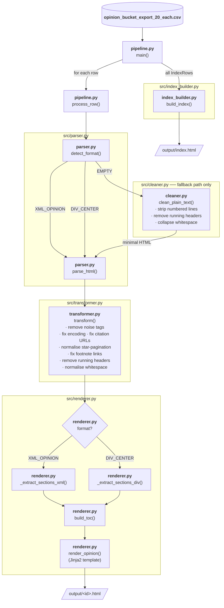

# Legal Opinion Cleanup & Rendering Pipeline

A Python 3.10+ pipeline that ingests 60 federal appellate opinions from a CourtListener CSV export and produces clean, readable, self-contained HTML for each opinion — plus a searchable index. Created using Google Antigravity 2.

Browse the results: **[output/index.html](https://huang-pan.github.io/takehome_ag/output/index.html)**

---

## Quick Start

```bash
pip install -r requirements.txt
python pipeline.py
# Outputs to output/ (61 files: index.html + one per opinion)
```

Run tests:
```bash
python -m pytest tests/ -v
```

---

## Design Decisions

### 1. Primary Input: `html_with_citations`

The `html_with_citations` field is the primary source for every opinion. It already contains:

- **Semantic citation tags** (`<span class="citation">`) — preserving these is far cheaper than re-detecting citations from plain text.
- **Star-pagination markers** (`<span class="star-pagination">`) — exact reporter page boundaries that lawyers rely on for citation pinpoints.
- **Footnote structure** (`<a class="footnote">`, `<div class="footnote">`) — already linked forward; we enrich with backward links.
- **Emphasis and structure** (`<em>`, `<p>`, author headings) — partial structure already present.

The `plain_text` field is used as a **fallback only** when `html_with_citations` is empty, or to supplement page-break positions when HTML lacks star-pagination. For this dataset all 60 rows have non-empty HTML.

**Trade-off**: The HTML has its own artefacts (repeated paragraph headers, occasional mojibake, whitespace collisions from justified-text layout). We clean these in the transformer step rather than falling back to plain text, because HTML cleaning preserves more information.

### 2. Two HTML Formats — Handled Uniformly

CourtListener ships opinions in two distinct HTML flavours:

| Format | Marker | Count in dataset |
|--------|--------|-----------------|
| **XML-flavored** | `<?xml ...><opinion type="...">` with `<p id="...">` paragraphs | 56 / 60 |
| **div/center** | `<div><center>...<h1>...` legacy style | 4 / 60 |

Both are handled by `src/parser.py`:
- XML-flavored: parsed with `lxml-xml`, falling back to `html.parser` for any malformed documents.
- div/center: always parsed with `html.parser` (lxml's strict XML parser rejects these).

Section extraction logic (`src/renderer.py`) branches on format:
- `_extract_sections_xml` walks `<opinion>` root elements and their children.
- `_extract_sections_div` detects a caption block from leading `<center>/<h1>` elements then reads body paragraphs.

### 3. Cleaning Strategy

All cleaning happens in the transformer pass (`src/transformer.py`) after parsing, before section extraction. Key steps:

| Step | Where | Rationale |
|------|-------|-----------|
| `ftfy.fix_text()` on all text nodes | transformer | Repairs mojibake from double-encoded UTF-8 and Windows-1252 sequences |
| Noise tag removal (`<script>`, `<style>`) | transformer | Safety and cleanliness |
| Repeated paragraph removal (≥2 occurrences, ≤100 chars) | transformer | Running headers like "PUBLISHED", "IN RE KIRKLAND" appear across page-break paragraphs |
| Multi-space collapsing in text nodes | transformer | PDF justified-text layout creates `word   word   word` patterns |
| `&nbsp;` → regular space | transformer | Common in HTML extracted from old PDF toolchains |

For **plain_text** (fallback path), `src/cleaner.py` additionally:
- Detects and strips **numbered lines** (2nd Circuit typewriter style: ` 1   UNITED STATES ...`), activating only when ≥5 consecutive numbered lines are found, to avoid false positives on content that starts with a digit.
- Removes **stranded page numbers** (lines consisting entirely of 1–4 digits).
- Detects **running headers** within ±4 lines of each `\f` form-feed and removes lines appearing ≥2 times.

### 4. Page Boundaries

**Star-pagination** (`<span class="star-pagination">`) marks the point in the text where a new page of the bound reporter volume begins — the kind of citation lawyers use (`*311` = page 311 of the volume). These are rendered as:

```html
<a id="star-311" href="#star-311" class="star-page-inline" data-page="311" title="Reporter page 311">*311</a>
```

This means `opinion_355.html#star-153` deep-links directly to reporter page 153, as required.

Two source formats handled:
- XML: `<span citation-index="1" class="star-pagination" label="153"> *153 </span>` → label attribute extracted.
- div: `<span class="star-pagination">*311</span>` → page number parsed from text content.

**Form-feed page breaks** from `plain_text` are converted to `<!-- PAGE_BREAK -->` markers in the fallback path and rendered as inline `p.N` anchors.

### 5. Footnotes — Bidirectional Links

The XML format already provides forward links (`<a class="footnote" href="#fn1" id="fn1_ref">`) and footnote containers (`<div class="footnote" id="fn1" label="1">`). The transformer (`_fix_footnotes`) adds the missing backward link:

```html
<!-- Added by transformer: -->
<a href="#fn1_ref" class="footnote-backref" aria-label="Back to reference">↩</a>
```

The renderer then wraps each footnote in a styled `<div class="footnote-item" id="fn1">` with:
- Superscript number on the left
- Body text in the middle
- `↩` backref link at the end

### 6. Citations

All `<span class="citation">` elements are preserved and passed through the `_render_inline_tag` path. Relative CourtListener URLs (starting with `/`) are made absolute by prepending `https://www.courtlistener.com`. External links and already-absolute URLs are left unchanged.

### 7. Self-Contained Output

Each HTML file links to `assets/style.css` via a relative path. The stylesheet uses the `@import url(...)` Google Fonts call as a **progressive enhancement** — opinions still render readably using the system serif fallback if the network is unavailable (since no page body depends on the font loading).

No CDN-hosted JavaScript frameworks are used. The back-to-top button and TOC highlight are ~20 lines of vanilla JS.

---

## What Works Per Bucket

### Easy (20 opinions, avg ~3 pages, avg ~4 KB)
✅ Clean, readable rendering with no obvious artefacts.  
✅ Short per-curiam opinions rendered fully in a single section.  
✅ Footnotes (where present) correctly linked bidirectionally.  
✅ Citations preserved and clickable.  
✅ Metadata cards (court, date, docket, judges) accurate.

### Medium (20 opinions, avg ~9 pages, avg ~15 KB)
✅ Star-pagination anchors preserved and linkable (`#star-N`).  
✅ Multi-section opinions (Background, Discussion, Conclusion) have navigable TOC.  
✅ Citation density high (up to ~50 citations per opinion) — all preserved.  
✅ Counsel block rendered in styled box.  
⚠ Some medium opinions mix caption text with the body (caption detection heuristic is conservative — prefers to put content in the body over incorrectly labelling it as caption).

### Hard (20 opinions, avg ~15 pages, avg ~28 KB)
✅ Large opinions (29-page Cameron v. City of New York) render fully without truncation.  
✅ Star-pagination working across multi-page opinions (15+ anchors).  
✅ **2nd Circuit numbered-line stripping** active for `opinion_id=46` (Cameron) — 29-page opinion with typewriter-style numbering.  
✅ Multi-opinion docs (majority + dissent) render as separate labelled sections.  
⚠ Some hard opinions have unusually dense whitespace in short paragraphs that were justified in the original PDF — these are passed through mostly clean but occasional double-spaces may remain.  
⚠ The div/center hard opinion (id=68, Kirkland) has centre-aligned heading blocks that are placed in the caption section; body flows correctly.

---

## What's Still Broken / Would Fix Next

| Issue | Severity | Fix |
|-------|----------|-----|
| Some running headers slip through when they appear only once near the first page break | Low | Cross-reference with case_name metadata to detect court-specific boilerplate ("UNITED STATES COURT OF APPEALS FOR THE FOURTH CIRCUIT") |
| Numbered-line detection relies on ≥5 *consecutive* lines — interspersed blank lines (as in real 2nd Circuit opinions) reduce detection sensitivity | Medium | Count numbered lines within a sliding window, not just consecutive |
| Counsel block not automatically extracted for XML format — it's rendered as body paragraphs instead | Low | Detect paragraphs matching `_COUNSEL_RE` pattern within the first N paragraphs and move them to the counsel block |
| `page_count` from CSV sometimes doesn't match actual star-pagination count (OCR/extraction inconsistency) | Info | Log discrepancy; use star-pagination count as ground truth |
| `extracted_by_ocr=f` for all 60 rows — OCR path is written but untested | Low | Would need a real OCR sample to validate |
| Inline `@import` Google Fonts requires network; no local font files bundled | Low | Embed WOFF2 as base64 data URIs or ship font files in `assets/fonts/` |
| TOC only captures `<h2>`/`<h3>` headings — many opinions use `<p>` uppercase text for section headings | Medium | Post-process body HTML: detect all-caps short paragraphs (likely `BACKGROUND`, `ANALYSIS`, etc.) and upgrade them to `<h3>` |

---

## Architecture

### Code flow



```
pipeline.py          Entry point — reads CSV, iterates rows, calls processor, handles errors
src/
  parser.py          Format detection (XML vs div/center), BeautifulSoup parsing
  cleaner.py         Plain-text cleaning (fallback path): headers, line numbers, whitespace
  transformer.py     HTML in-place transforms: star-pagination, footnotes, citations, whitespace
  renderer.py        Section extraction, TOC generation, Jinja2 template rendering
  index_builder.py   Builds index.html from a list of IndexRow metadata objects
output/
  index.html
  <opinion_id>.html × 60
  assets/style.css
tests/
  test_cleaner.py    12 tests: page breaks, numbered lines, running headers, whitespace
  test_parser.py     11 tests: format detection, parsing, fallbacks
  test_transformer.py 14 tests: star-pagination, citations, footnotes, whitespace
```

### Module responsibilities

| Module | Lines | Responsibility |
|--------|-------|----------------|
| `parser.py` | ~70 | Detect format, wrap BeautifulSoup with lenient fallback |
| `cleaner.py` | ~130 | Plain-text artifact removal (used only in fallback path) |
| `transformer.py` | ~180 | In-place HTML normalisation (runs on all opinions) |
| `renderer.py` | ~430 | Section extraction + Jinja2 template |
| `index_builder.py` | ~100 | Index page template |
| `pipeline.py` | ~130 | Orchestration, CSV I/O, error isolation |

### Error isolation

Each opinion is wrapped in a `try/except Exception` block in `process_row()`. Failures are logged with a full traceback but do not abort processing. The index page marks failed opinions with a ⚠ icon.

---

## Dependencies

| Package | Version | Why |
|---------|---------|-----|
| `beautifulsoup4` | ≥4.12 | Lenient HTML/XML parsing; handles both formats |
| `lxml` | ≥5.0 | `lxml-xml` parser for strict XML opinions; faster than `html.parser` |
| `ftfy` | ≥6.1 | Unicode repair (mojibake from double-encoded PDF extraction) |
| `Jinja2` | ≥3.1 | Templating for opinion and index HTML pages |
| `pytest` | ≥7.4 | Testing |

Standard library only elsewhere: `csv`, `re`, `logging`, `pathlib`, `dataclasses`, `collections`.
